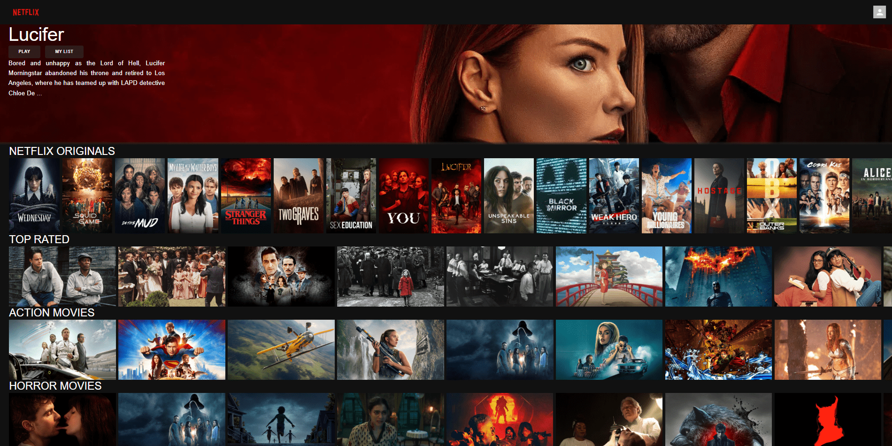
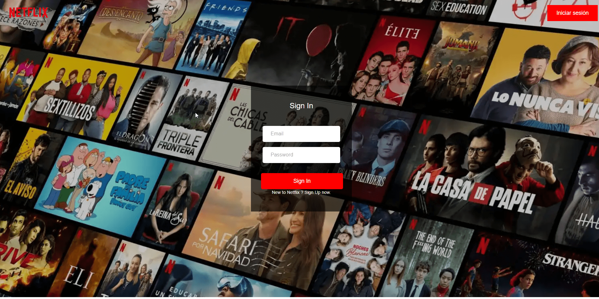
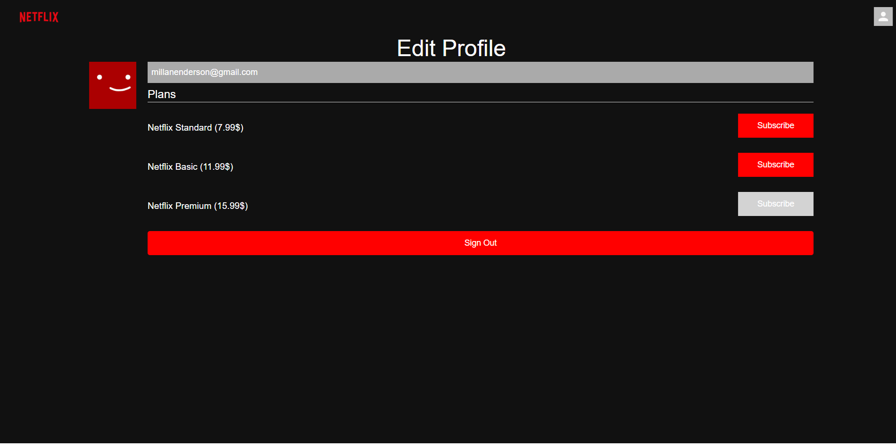
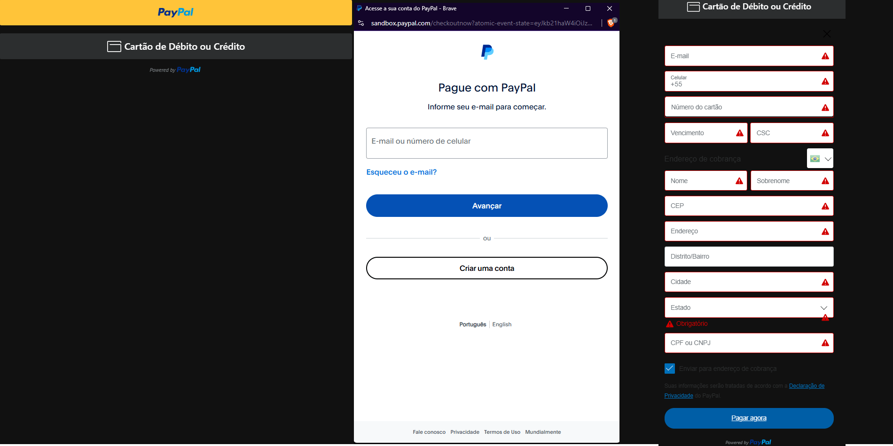

## Título do Projeto

<strong>Netflix Clon</strong>

## Descrição do Projeto

<p style="text-align: justify;">
  O Netflix Clon é uma aplicação web de simulação de serviço de streaming de vídeo, projetada para replicar as principais funcionalidades de uma plataforma de entretenimento digital. O projeto foca em uma arquitetura de frontend robusta, gestão de estado eficiente e integração com serviços de backend para uma experiência de usuário fluida e responsiva.
</p>

## Funcionalidades-Chave:

- Streaming de Conteúdo: Interface para navegação e visualização de filmes e séries, com uma experiência de navegação intuitiva.

- Gestão de Assinaturas e Pagamentos: Integração com o PayPal, permitindo a simulação de um fluxo de pagamento seguro e eficiente para assinaturas.

- Autenticação e Gestão de Usuários: Sistema de login e registro de usuários com segurança, utilizando o Firebase para autenticação e gestão de dados.

- Interface Interativa: Utiliza componentes de UI do Material-UI e alertas interativos do SweetAlert2 para uma experiência de usuário dinâmica e agradável.

## Stack Tecnológica:

- Frontend: A aplicação é construída com a biblioteca React, utilizando Redux Toolkit para um gerenciamento de estado previsível e escalável. A navegação entre as páginas é gerenciada pelo React Router DOM, enquanto as requisições a APIs externas são realizadas com Axios.

- Design e Componentes: O design é padronizado e consistente, utilizando a biblioteca de componentes Material-UI. A estilização específica é tratada com Styled Components, permitindo um desenvolvimento de UI modular.

- Backend e Banco de Dados: O Firebase é utilizado como a principal plataforma de backend, fornecendo serviços de autenticação, banco de dados (Realtime Database ou Firestore) e armazenamento de arquivos.

## Stack Tecnológica:

- Frontend: Construído com React e o framework Next.js, o projeto utiliza TypeScript para garantir escalabilidade e um código mais robusto.

- Design e Componentes: A interface é moderna e acessível, com estilização realizada usando o Tailwind CSS. Componentes reutilizáveis são implementados com as bibliotecas Radix UI e Lucide React para uma aparência consistente e profissional.

- Backend e Banco de Dados: A gestão de dados é feita de forma segura com o ORM Prisma, que simplifica a interação com o banco de dados. A autenticação é gerenciada com NextAuth, proporcionando um sistema de login eficiente e personalizável.

- Validação e Manipulação de Dados: Formulários são gerenciados de forma eficiente e segura com React Hook Form e validações com a biblioteca Zod.

## Capturas de Tela

<div style="overflow-x: auto;">
    <table style="width: 100%;">
        <tr>
            <td style="width: 50%;"></td>
            <td style="width: 50%;"></td>
        </tr>
        <tr>
            <td style="width: 50%;"></td>
            <td style="width: 50%;"></td>
        </tr>
    </table>
</div>

## Começando

### Pré-requisitos

Você precisa instalar o seguinte software

1.  NODEJS(VERSION: 20.10.0)
2.  NPM(VERSION: 10.2.3)
3.  GIT

### A maneira mais fácil para começar é clonar o repositório:

git clone [https://github.com/ENDERSON-MARIN/DOUTOR-AGENDA](https://github.com/ENDERSON-MARIN/DOUTOR-AGENDA)

### Mude o diretório e abra no editor de texto

- cd your-project-directory
- open in your text editor

### Configure suas variáveis de ambiente (Clone o arquivo .env.template e renomeie para .env)

- REACT_APP_BASE_URL = ""
- REACT_APP_API_KEY = ""
- REACT_APP_PAYPAL_CLIENT_ID =""
- REACT_APP_FIREBASE_APIKEY = ""
- REACT_APP_FIREBASE_AUTHDOMAIN = ""
- REACT_APP_FIREBASE_PROJECTID = ""
- REACT_APP_FIREBASE_STORAGEBUCKET = ""
- REACT_APP_FIREBASE_MESSAGINGSENDERID = ""
- REACT_APP_FIREBASE_APPID = ""

### Inicie seu aplicativo de forma muito simples

- Start the project in development mode

```
npm run start
```

- Você pode verificar que o site estará funcionando em localhost
  http://localhost:3000

## Autor

- [Enderson Marín](https://www.marinenderson.com)

## Meu contato:

- 📧 Email: marinenderson1@gmail.com
- 🐱 GitHub: https://github.com/ENDERSON-MARIN
- 🌐 Portfolio: https://portfolio-ecmm.vercel.app/
- 💼 LinkedIn: https://www.linkedin.com/in/enderson-marin

## Vídeos de Demonstração

- Você pode verificar um vídeo de demonstração do meu projeto no seguinte canal:

  https://www.youtube.com/channel/UCDIIj706aFneZlfVJucVkhA

## Licença

Este projeto está licenciado sob a Licença MIT - consulte o arquivo [LICENSE.md](LICENSE.md) para obter detalhes
